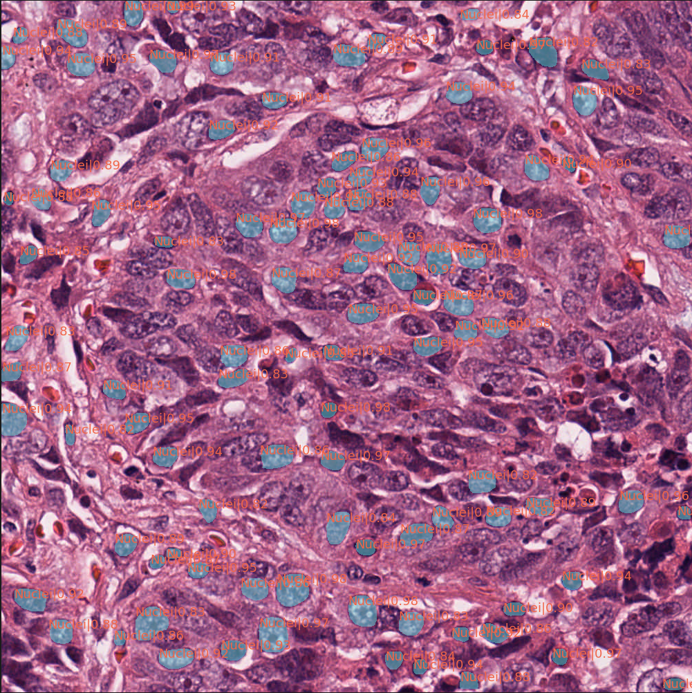

install the MMdetection on Windows10 : teaching website
        
        reference : http://www.4k8k.xyz/article/weixin_41922853/118445620

Data preprocess:
  1. transform data to compatible the model (here is coco format), use trans2coco.py and split_train_val.py to get instance_train2017.json and instance_val2017.json
  2. put data in data/coco
  
    data/  
      coco/  
        annotations/  
           instance_train2017.json  
           instance_val2017.json
           instance_test2017.json
        train/  
           xxx.png  
        val/
           xxx.png
        test/  
           xxx.png  
          

Train and validation:
must run the following command in the mmdetection folder , train.py is the built-in code in MMdetection

      python tools/train.py {the position of model.py}

Test:

use test_coco.py to get instance_test2017.json

must run the following command in the mmdetection folder , test.py is the built-in code in MMdetection

      python tools/test.py {the position of pretrained weight} --format-only --options jsonfile_prefix=${JSONFILE_PREFIX}

after exection can directly get the bbox.json and segm.json and segm.json is answer.json

pretrained weight : 

        https://drive.google.com/file/d/1fhpOVfWGyndFDm9V_oxDztO2_SVTnmce/view?usp=sharing 

demo on one test image

